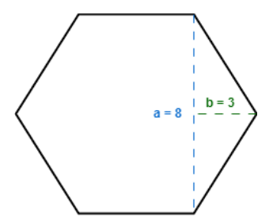
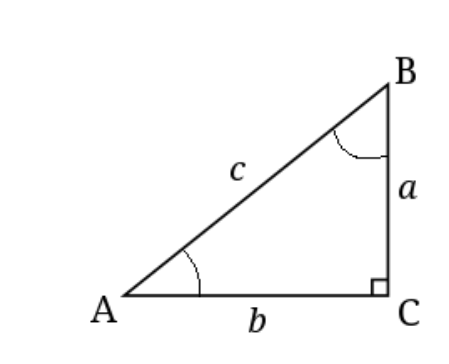
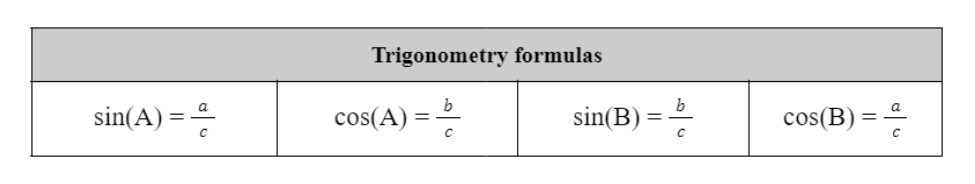

# Week-01; Home Task

### Task-01: Write a Java program to convert minutes into years and days. For simplicity, assume each year consists of 365 days.

Test Data:
```
Given the number of minutes: 3456789
```

Expected Output:
```
3456789 minutes is approximately 6 years and 210 days
```

### Task-02: Write a Java program based on the mentioned scenario that prints the value of d after calculation.

Suppose, you have three integer variables: a, b, c.
Your first task is to assign the values 2, 5, 8 in these three variables.
Next, you need to calculate and display the value of variable d using the following formula:

$$
d = (2 \cdot b \times \frac{c-a}{3}) + 7
$$

> [Answer: 27]

### Task-03: Write a Java program that displays the 2 rightmost digits of your student ID in reverse order. For example, if your student id is 23221454, you need to print 4, and then 5.

> [Hint: Use the logic you used in one of the tasks in flowchart]

### Task-04: Assume a Hexagon where each of the sides are of the same length. From the visualization, we can see the values of a and b are given. Your task is to write a Java code to find the area and the circumference of the Hexagon. 



### Task-05: Design a Java program to calculate Sin and Cos values from a right-angled triangle. 

Assume the values of a and b are 4.5 and 9.5 respectively.
Finally, print the Sin and Cos values of angle A and angle B (SinA, CosA, SinB, CosB). The formulas to calculate these values are given below.




> Hint: You need the values for all 3 sides to calculate both sin and cos. You are given only a and b. How would you get the value of c? You’ll need the help of Math.sqrt().



